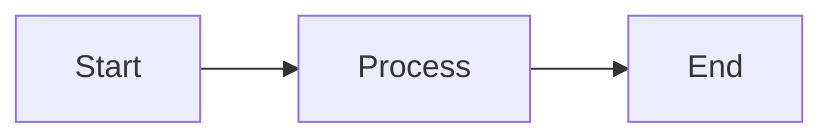

Trace and document the complete request lifecycle flow.

## Output Location

Write to: `docs/flows/request-lifecycle.md`

## Purpose
Explain why this flow exists and its architectural role.

## Trigger Points
List events, HTTP actions, schedulers, or jobs that start this flow.

## Actors
Users, services, queues, systems involved.

## Lifecycle Steps
Step-by-step process from start to finish.

## Laravel Components Involved
Controllers, middleware, services, models, events, jobs.

## Data Mutations
Database or cache changes during this flow.

## State Transitions
If applicable, describe status/state changes.

## Failure Paths
Errors, retries, rollbacks, fallback behavior.

## Security Considerations
Auth, validation, data protection, abuse vectors.

## Performance Considerations
Caching, queues, async execution, bottlenecks.

## Observability
Logs, metrics, monitoring, alerting.

## Extension Points
Where developers can customize/extend.

## Output Format

```markdown
# Request Lifecycle Flow

## Flow Diagram


```

## Rules

- Use `graph LR` or `graph TB` only
- No `flowchart`, `sequenceDiagram`, `erDiagram`, `classDiagram`
- Include key code file paths
- Document error scenarios
