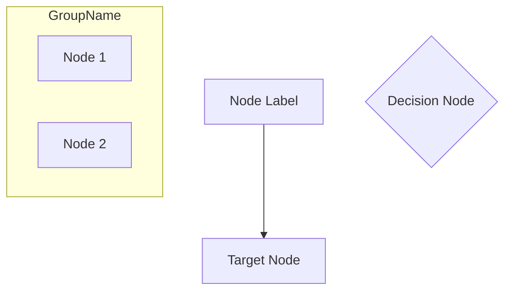
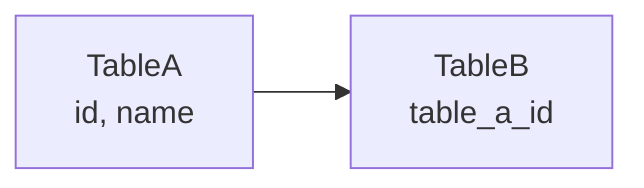

Generate diagrams for:

- system topology
- authentication lifecycle
- request lifecycle
- ER relationships

Rules:

- Use `graph TB` or `graph LR` (NOT `flowchart TB`)
- Use simple node labels without special characters
- Use arrows: `A --> B` for relationships
- Use subgraph for grouping: `subgraph Name ... end`
- Keep labels short
- One diagram per section

### Mermaid v11 Syntax (Zensical)

### Avoid (deprecated in v11)

- `flowchart TB` - use `graph TB` instead
- `erDiagram` - not supported
- `classDiagram` - not supported
- Complex node shapes with `<>` or `[]` inside labels
- Quoted labels with special chars

### Database ER Diagrams

Use simple graph syntax:

